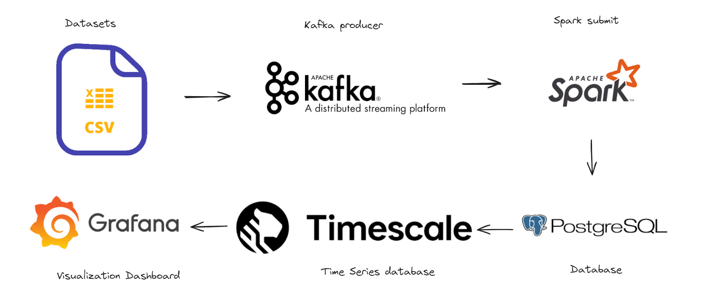

# StockSpark
Objective is to develop a real-time analysis system utilizing Apache Kafka and Apache Spark. This system will gather real-time data and stream it into Kafka. Apache Spark will then process and analyze the data in real-time, with the processed data visualized using appropriate visualizations and graphs.

## Components
The system consists of two main components:

* **Data Collection:** This component gathers real-time stock data . The collected data is cleaned and transformed into a structured format before being streamed into Kafka.

* **Data Processing and Visualization:** This component processes real-time data streams using Apache Spark. Spark executes various real-time analysis tasks like trend analysis, stock prediction, and outlier detection. The processed data is then visualized using interactive dashboards and graphs to provide real-time insights into stock market trends.

The system is designed to be scalable, capable of handling large volumes of data streams and conducting real-time analysis.

## Technology Stack
The project will leverage technologies such as **Apache Kafka, Apache Spark, Docker, Jupyter Notebook, and a front-end visualization tool like Grafana**. It will be implemented using an On-premises architecture, ensuring high availability and scalability.

## Project Flowchart

This flowchart illustrates the workflow of the project, depicting how data is collected, processed, and visualized in real-time.
